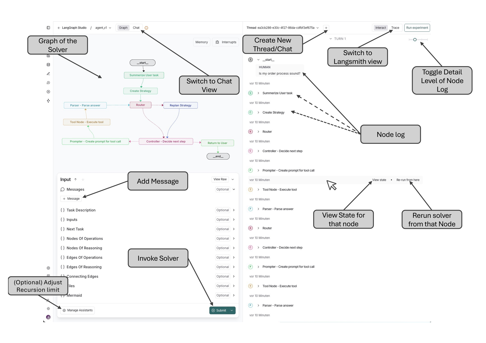
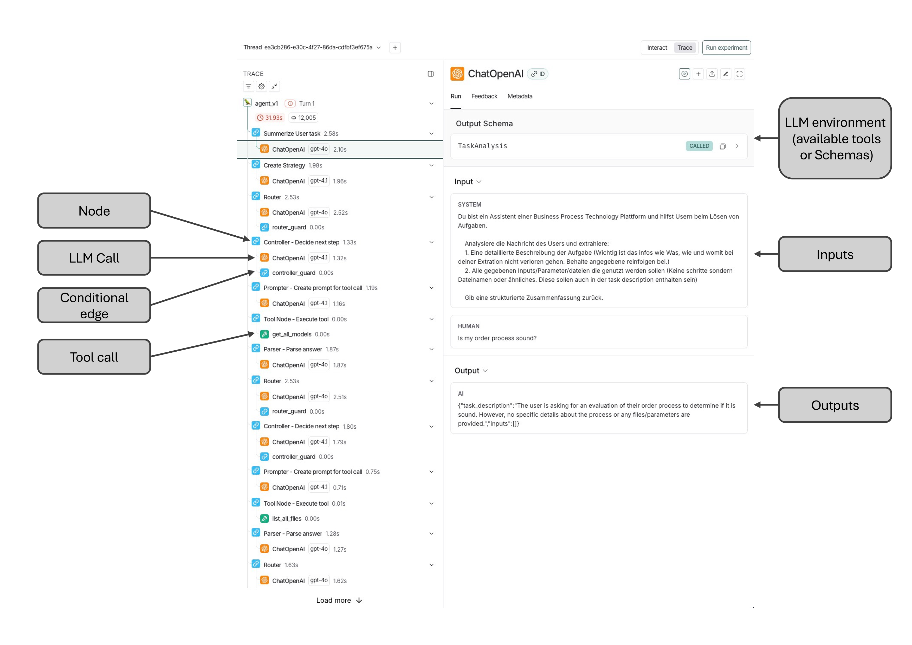
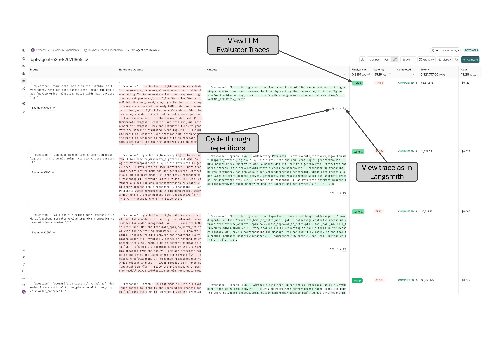

<div align="center">
  <h1>PRAXIS</h1>
  <h3>Process Research Artifact eXecution and Integration System</h3>
</div>

# Introduction

This repository contains a prototype implementation and evaluation framework.
It includes the following components:

- **Solver (LLM System):**
  Implemented with **LangGraph** and **LangChain**, the solver takes a BPM-related task, plans a solution path, and attempts to execute it.

- **Workshop (MCP Tool Servers):**
  Modular MCP servers providing BPM tools (process mining, BPMN modelling (mocked), linting) and file management.

- **Automated Evaluator:**
  Scripts and tests to automatically assess the solver's planning and execution performance.

---

This repository can be used in two ways:

1. Using the PRAXIS interactively
2. Using the evaluation scripts

In the following sections, each usage scenario and setup process will be explained.


> **Disclaimer**
> - This project is tailored to **OpenAI models**, meaning you will need an **OpenAI account** and available **credits**.
> - Other (including local) models may work thanks to the standardized LangChain interface, but they have **not been tested**.
> - For easier debugging, a **LangSmith account** is recommended.
> - For automated testing a **LangSmith account** is required.

# Table of Contents

- [Introduction](#introduction)
- [Project Structure](#project-structure)
- [Setup](#setup)
  - [Python Environment](#python-environment)
  - [Running the LangGraph Studio UI](#running-the-langgraph-studio-ui)
  - [Exploring the LangGraph Studio UI](#exploring-the-langgraph-studio-ui)
  - [LangSmith Integration](#langsmith-integration)
- [Use Cases](#use-cases)
  - [1. Using the Agent](#1-using-the-agent)
  - [2. Agent Evaluation](#2-agent-evaluation)
- [Architecture](#architecture)
  - [Solver](#solver)
  - [Workshop (MCP)](#workshop-mcp)
  - [Evaluator](#evaluator)


# Project Structure

```
PRAXIS/
├── solver/                          LangGraph agent (planning, execution, replanning)
│   ├── agent.py                     Graph definition (entrypoint)
│   └── utils/
│       ├── state.py                 AgentState (strategy plan + execution protocol)
│       ├── data_types.py            Data models (Graph, Nodes, Edges)
│       ├── tools.py                 MCP tool loader
│       ├── nodes/                   Node implementations
│       │   ├── io_nodes.py          Input/output nodes
│       │   ├── planner_nodes.py     Planning & replanning
│       │   └── execution_manager_nodes.py  Execution management
│       └── tool_components/
│           └── mcp_tools.py         MCP client configuration
│
├── workshop/                        MCP tool infrastructure
│   ├── workbench/                   Central integration layer
│   │   ├── mcp_server.py            Workbench MCP server (file management + tool proxy)
│   │   ├── config.py                Configuration (paths, tool definitions)
│   │   ├── file_manager.py          Per-user file storage
│   │   └── tool_registry.py         Tool server lifecycle management
│   ├── tools/                       Tool MCP servers
│   │   ├── pm4py_tools/server.py    Process mining (discovery, rendering, analysis)
│   │   ├── camunda/server.py        Camunda 7 deployment & execution
│   │   ├── bpmn_lint/server.py      BPMN validation (Node.js wrapper)
│   │   └── modelbpmn/server.py      BPMN modelling
│   └── data/{user_id}/              Per-user file storage (gitignored)
│
├── testing/                         Evaluation framework
│   ├── run_testset.py               Testset executor (LangSmith integration)
│   ├── evaluator.py                 File comparison + LLM-as-a-judge
│   ├── test_environment.py          Test harness (user isolation, MCP client)
│   ├── generate_testset.py          Testset generator from lifecycle graphs
│   ├── transform_difficulty.py      Destructure questions into BPM domain language
│   └── test_cases/
│       ├── baseline/                Activity definitions, Mermaid graphs, fixtures
│       └── generated/               Pre-generated testsets
│
├── docs/                            Screenshots, env.example
├── docker-compose.yml               Camunda 7 Engine
└── requirements.txt                 Python dependencies
```

## Available Tools (via MCP)

| Server | Tools |
|--------|-------|
| **pm4py_tools** | `analyze_event_log`, `discover_dfg`, `render_dfg`, `discover_heuristic_net`, `render_bpmn`, `convert_bpmn_to_petri_net`, `check_petri_net_property`, `render_petri_net` |
| **camunda** | `deploy_bpmn`, `get_process_status`, `export_event_log`, `downgrade_bpmn_to_camunda7` |
| **bpmn_lint** | `lint_bpmn` |
| **modelbpmn** | `remodel_bpmn` (mock — returns a static example BPMN) |


# Setup

After cloning the repository, you first need to set up your environment variables:

1. Duplicate the file `docs/env.example` and rename it to `.env` and move it to the project root.
2. Add the following values to `.env`:
   - Your **OpenAI API key**
   - Your **LangSmith API key**
   - The **LangSmith project name**

To obtain a LangSmith account, register here: [LangSmith EU](https://eu.smith.langchain.com/)

> Important: Make sure to select the **EU or US region** during signup.

Once registered, you can create a new API key under:
`Settings -> API Keys`

The **project name** can be set freely and will appear automatically in the main LangSmith window after your first run.

---

### Python Environment

The repository requires a Python virtual environment.
The setup was tested with **Python 3.13.5**.

1. Create and activate a virtual environment.
2. Install the dependencies:
```bash
pip install -U langgraph "langchain[openai]"
pip install -r requirements.txt
```

---

### Running the LangGraph Studio UI

Once everything is installed, you can start the local **LangGraph Studio UI** by running:
```bash
cd solver && langgraph dev
```
This should automatically open LangGraph in a new browser window.

For an easy introduction to the LangGraph environment itself, this video is highly recommended:
[Introduction to LangGraph](https://www.youtube.com/watch?v=Mi1gSlHwZLM)

The Camunda 7 Engine must be running for the camunda tools to work:
```bash
docker compose up -d
```

#### Exploring the LangGraph Studio UI

Because the LangGraph Studio UI can be somewhat complex, here are the most important elements highlighted:



- **Top left:** The execution graph with its nodes.
- **Below the graph:** All variables currently stored in the state.
- **+Message / Submit:** Use this to ask questions or give tasks to the solver.

#### Recursion Limit

- By default, execution has a **recursion limit of 25**, which may be too low for complex graphs.
- You can increase this under **Manage Assistant** — a range of **75-120** is recommended.
- Alternatively, when the recursion limit is reached, the UI will prompt you to continue execution.

#### Execution Log

- After pressing **Submit**, a log of activated nodes appears on the **right side** of the window.
- The **slider in the top right** controls the level of detail:
  - Far left: only the first and last node are shown
  - Far right: every node including the state at that moment
- Hovering over a node allows you to:
  - Inspect the state at that node
  - Modify variables
  - Restart execution from that node

#### Managing Threads and Views

- **+ (top bar):** Create a new thread/chat to keep work organized.
- **Top left:** Switch to a ChatGPT-like interface for simple chatting.
- **Top right:** Switch to the **LangSmith view** for detailed process tracing (langsmith account required).

#### LangSmith Integration



In the LangSmith view (langsmith account required):
- The **left panel** shows the timeline of execution — nodes, LLM calls, and tool calls.
- Clicking on any entry reveals detailed inputs and outputs, such as:
  - Input messages (system and user prompts)
  - Output from the LLM
  - The call format used
  - Tool inputs/outputs


# Use Cases

## 1. Using the Agent

After completing the **Setup**, start the LangGraph Studio UI with `langgraph dev` (from the solver folder) and submit your BPM-related tasks via the **+Message / Submit** input. The solver will plan and execute using the available MCP tools.


## 2. Evaluation

Once the solver is running, you can execute the evaluation with a generated testset:

```bash
python -m testing.run_testset \
    --testset testing/test_cases/generated/testset_design-analysis_L2.json \
    --project my-eval-project \
    --repetitions 1 \
    --max-concurrency 4
```

Pre-generated testsets are available in `testing/test_cases/generated/`. To generate new testsets or transform difficulty levels:

```bash
# Generate testset from lifecycle graph + baseline
python -m testing.generate_testset \
    --baseline testing/test_cases/baseline/activitys.json \
    --graph testing/test_cases/baseline/design-analysis-phase.md \
    --windows 1 2 3 \
    --output testing/test_cases/generated/my_testset.json

# Destructure questions into natural BPM domain language
python -m testing.transform_difficulty \
    --input testing/test_cases/generated/my_testset.json \
    --output testing/test_cases/generated/my_testset_destructured.json
```

The results can then be viewed in **LangSmith** under:
`Datasets & Experiments -> <Dataset Name>`

- Each execution of the script is summarized as an **experiment**.
- By clicking further into an experiment, you can analyze all solver runs and results in detail.



> **Cost Notice:**
> Running the evaluator costs OpenAI tokens. To minimize costs, you can reduce the number of **repetitions** or use a smaller testset.

### Inspecting MCP Servers

You can inspect the MCP servers directly using the MCP Inspector:

```bash
npx @modelcontextprotocol/inspector python workshop/workbench/mcp_server.py
npx @modelcontextprotocol/inspector python workshop/tools/pm4py_tools/server.py
npx @modelcontextprotocol/inspector python workshop/tools/camunda/server.py
```


---

# Architecture

## Solver

The solver is implemented with **LangGraph** and **LangChain**. The folder structure is adapted from the [LangGraph Example Project](https://github.com/langchain-ai/langgraph-example-pyproject). The design builds on two key concepts which were adapted for this project:

- **Graph of Thoughts** (Besta et al., 2024) — The state representation (GoO + GRS) is derived from this work. Unlike the original, the strategy plan is not manually defined but generated by an LLM (Planner), and both graphs are unified into a single state with connecting edges for traceability.
- **ReAct** (Yao et al., 2022) — The planning–execution loop (Router → Controller → Executor → Parser → Router) implements a multi-layered variant of the ReAct pattern, extended with replanning capabilities to recover from errors in the strategy.


### State

The `AgentState` (`solver/utils/state.py`) is a `TypedDict` that holds two fundamental graph structures, adapted from Graph of Thoughts (Besta et al., 2024):

- **Graph of Operations (GoO)** — the strategy plan. Nodes are planned steps (`OperationsNode` with `name`, `description`, `goal`), and directed edges represent ordering constraints (which step must follow which).
- **Graph Reasoning State (GRS)** — the execution protocol. Nodes are individual LLM thoughts/results (`ReasoningNode` with `description`), and edges represent logical dependencies between reasoning steps. This graph is acyclic.
- **Connecting Edges** — link GoO steps to the GRS thoughts they produced. This makes it traceable which reasoning results were generated by which strategy step.

Concretely, the state stores these as dictionaries and adjacency lists:

```python
class AgentState(TypedDict):
    messages: Annotated[list[BaseMessage], add_messages]

    task_description: NotRequired[str]
    inputs: NotRequired[List[str]]
    next_task: NotRequired[Optional[List[str]]]

    nodes_of_operations: Dict[str, OperationsNode]   # GoO nodes
    nodes_of_reasoning:  Dict[str, ReasoningNode]     # GRS nodes
    edges_of_operations: Dict[str, List[str]]         # GoO adjacency list
    edges_of_reasoning:  Dict[str, List[str]]         # GRS adjacency list
    connecting_edges:    Dict[str, List[str]]          # GoO → GRS links

    mermaid: str  # Visual representation of the combined state graph
```

The `Graph` class (`solver/utils/data_types.py`) wraps these structures with methods for construction (`from_state`, `add_operation_node`, `add_reasoning_node`, `add_edge`), querying (`get_operations_nodes_pp`, `get_edges_pp`), and visualization (`to_mermaid`, `state_mermaid`).

The `state_mermaid()` method renders the combined graph using distinct edge styles:
- `==>` for operation edges (GoO)
- `--->` for connecting edges (GoO → GRS)
- `-.->` for reasoning edges (GRS)

### Execution Flow

The LangGraph workflow (`solver/agent.py`) compiles the following node graph:

```
Summarize User Task
        │
        ▼
  Create Strategy
        │
        ▼
  ┌── Router ◄──────────────────────┐
  │     │                           │
  │  continue                       │
  │     ▼                           │
  │  Controller ──► finish ──► Return to User ──► END
  │     │                           │
  │  tool_execution                 │
  │     ▼                           │
  │  Prompter                       │
  │     │                           │
  │     ▼                           │
  │  Tool Node                      │
  │     │                           │
  │     ▼                           │
  │  Parser ────────────────────────┘
  │
  replan
  │     ▼
  └► Replan Strategy ──► Controller
```

1. **Summarize User Task** — extracts a structured `task_description` and `inputs` from the user message using structured output.
2. **Create Strategy** — generates a GoO (nodes + edges) from the task description and the list of available tools. Uses structured output (`ExecutionGraph`) and JSON repair for robustness.
3. **Router** — evaluates the current state (GoO + GRS) and decides `"continue"` or `"replan"` via structured output (`RouterDecision`).
4. **Replan Strategy** — modifies the GoO based on critique from the router. Resets the GRS (clears reasoning nodes and connecting edges) to avoid artifact accumulation.
5. **Controller** — selects the next step from the GoO, along with any reasoning nodes needed as context. Returns `"{}"` when all steps are complete, which triggers the `controller_guard` to route to "finish".
6. **Prompter** — formulates a tool call by binding the available MCP tools to the LLM and passing the task description + context from previous reasoning nodes.
7. **Tool Node** — executes the tool call via LangGraph's `ToolNode`, which invokes the actual MCP tools from the workshop.
8. **Parser** — extracts relevant information from the tool result, creates a new `ReasoningNode`, adds it to the GRS, and creates the connecting edge from the operation node to the new reasoning node. Optionally summarizes the result to keep the context window compact.
9. **Return to User** — generates a natural language summary of the entire execution.

The **Router → Controller → Prompter → Tool Node → Parser → Router** loop continues until all strategy steps are executed or a replan is triggered. This loop implements a multi-layered ReAct pattern (Yao et al., 2022).


## Workshop (MCP)

**Model Context Protocol (MCP)** is a standardized protocol for connecting LLMs with contextual resources such as **files, prompts, and tools**.

- **MCP Servers** provide resources
- **MCP Clients** consume them

For more details, see the [MCP documentation](https://modelcontextprotocol.io/).

This repository contains multiple MCP tool servers in `workshop/tools/` and a central **workbench MCP server** in `workshop/workbench/` that:
- Provides **file management** (list, read, delete files per user)
- **Proxies tool calls** to the specialized tool servers
- **Normalizes parameters** (e.g., maps `file_path` to tool-specific content parameters)
- **Saves results** to the user's file storage (images, CSVs, JSON)

The workbench connects to tool servers via subprocess + stdio transport, managed by the **ToolRegistry**.

### Workbench Architecture

The workbench MCP server (`workshop/workbench/mcp_server.py`) acts as a gateway between the solver and all tool servers. It provides three categories of tools:

1. **File Management Tools** — `list_files`, `delete_file` for per-user file operations.
2. **Proxy Tools** — dynamically generated at startup from the connected tool servers. Tool schemas are rewritten so the solver sees `file_path` parameters instead of raw content parameters (e.g., `event_log`, `bpmn_file`). The workbench resolves file paths to file content before forwarding calls to the tool server.
3. **Utility Tools** — `get_available_tools` for tool discovery.

**Parameter Rewriting**: Parameters listed in `CONTENT_PARAMS` (`event_log`, `dfg_data`, `petri_net_file`, `bpmn_file`) are transparently rewritten. The solver sends a file path; the workbench reads the file content from the user's directory and maps it to the original parameter name before calling the tool server. This prevents file content from entering the LLM's context window, avoiding unintended modifications or incomplete data.

**Result Handling**: Tool results are saved to the user's file directory as `{tool_name}_result.{ext}`. Only a compact summary is returned to the solver — for JSON results, scalar values are shown directly while lists and dicts are summarized as `type[length]`. Images are decoded from base64 and saved as files. File content results (e.g., CSV exports, converted BPMN) are saved with the appropriate extension.

### File Manager

The `FileManager` (`workshop/workbench/file_manager.py`) scopes all file operations to `workshop/data/{user_id}/`. It enforces path traversal protection by resolving all paths and validating they remain within the user directory. Supports text reads/writes, binary writes (for images), and recursive user directory deletion.

### Tool Registry

The `ToolRegistry` (`workshop/workbench/tool_registry.py`) manages the lifecycle of tool server subprocesses. Each tool server runs as an independent subprocess communicating via MCP over stdio. The registry maintains two indexes:
- **Connection index**: maps server names to `ToolConnection` objects (live subprocess sessions)
- **Tool index**: maps individual tool names to their parent server (for routing calls to the correct subprocess)

## Evaluator

The evaluator uses **LangSmith** for automated evaluation and is based on generated testsets.

How it works:
- Testsets are generated from **BPM lifecycle graphs** (Mermaid) and a **baseline of 14 activities** (`testing/test_cases/baseline/activitys.json`).
- Each test case specifies a task, required input fixtures, and expected output files.
- The solver executes each test case using the workshop MCP tools.
- Results are evaluated by **file comparison** (existence, structure, size) and an **LLM-as-a-judge**.
- Generated testsets directly concatenate baseline activities into structured questions. Transformed testsets are produced by `transform_difficulty.py`, which restructures these into natural BPM domain language using an LLM.

> **Important Note:**
> We noticed that if the **content of a dataset changes but the dataset name remains the same**, LangSmith will not update the dataset.
> Therefore, it is crucial to also **change the dataset name** whenever the dataset contents are modified.


# License

This project is licensed under the **GNU Affero General Public License v3.0** (AGPL-3.0). See [LICENSE](LICENSE) for the full text.

The following files are based on the Camunda Invoice example and are licensed under the [Apache License 2.0](https://www.apache.org/licenses/LICENSE-2.0). See the [NOTICE](workshop/tools/modelbpmn/NOTICE) file for details.
- `workshop/tools/modelbpmn/invoice.bpmn`
- `testing/test_cases/baseline/fixtures/remodel_bpmn_result.bpmn`
