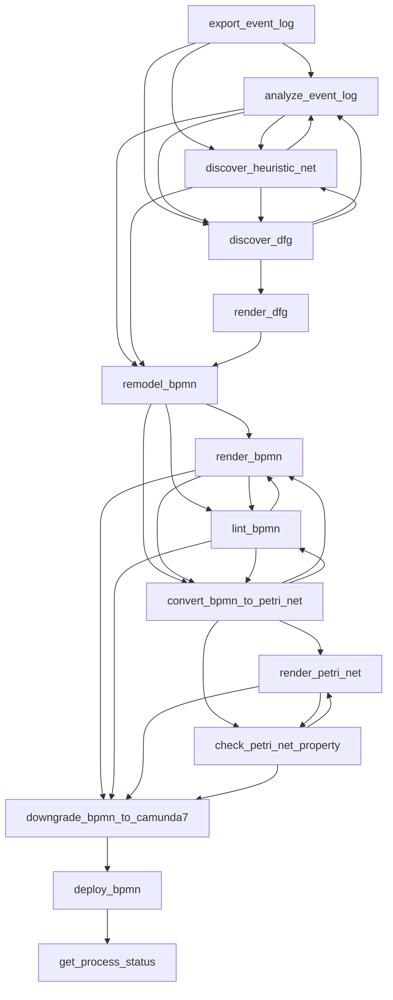

```mermaid
flowchart TB
    A[export_event_log]
    B[analyze_event_log]
    C[discover_heuristic_net]
    D[discover_dfg]
    E[render_dfg]
    F[remodel_bpmn]
    G[render_bpmn]
    H[lint_bpmn]
    I[convert_bpmn_to_petri_net]
    J[render_petri_net]
    K[check_petri_net_property]
    L[downgrade_bpmn_to_camunda7]
    M[deploy_bpmn]
    N[get_process_status]
    A --> B
    A --> C
    A --> D
    B --> C
    C --> B
    B --> D
    D --> B
    C --> D
    D --> C
    D --> E
    B --> F
    C --> F
    E --> F
    F --> G
    F --> H
    F --> I
    G --> H
    H --> G
    G --> I
    I --> G
    H --> I
    I --> H
    I --> J
    I --> K
    J --> K
    K --> J
    G --> L
    H --> L
    J --> L
    K --> L
    L --> M
    M --> N
```